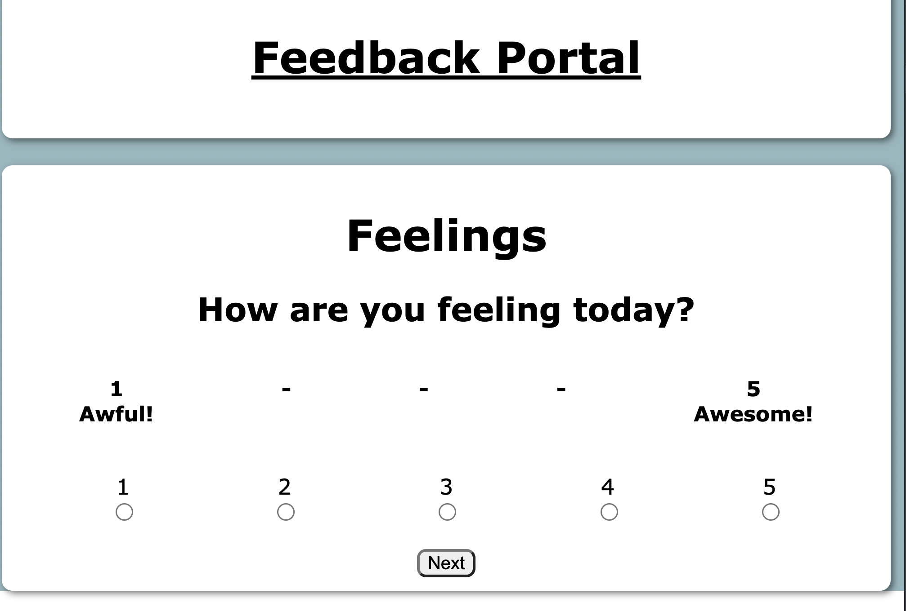
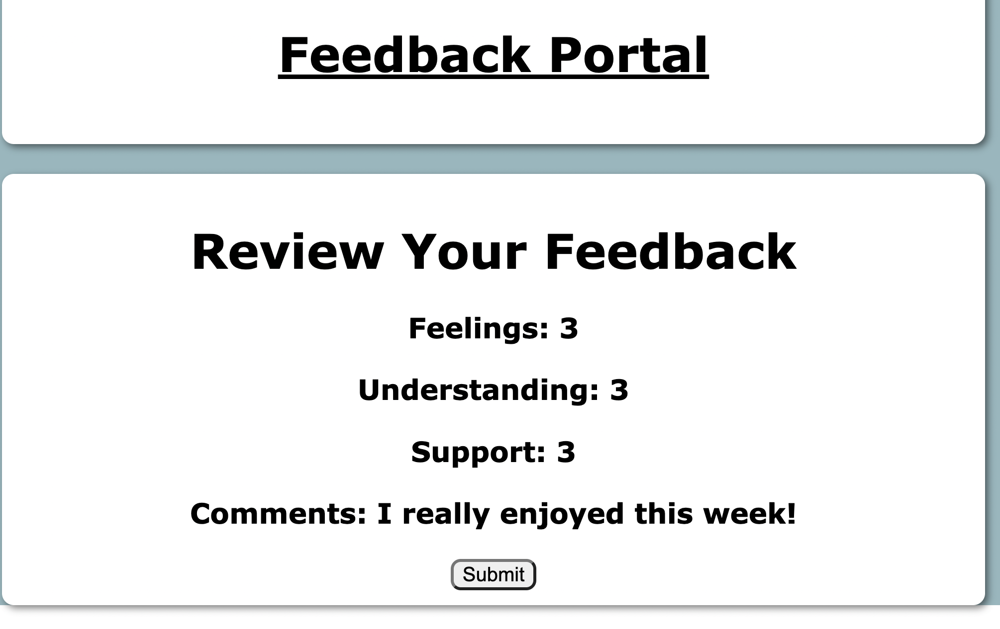

# Feedback in React

## Description

_Duration: Weekend Project_

For this project, created a basic single-page application which collects user feedback data in the form of numerical ratings and text comments. Once all the feedback has been collected, the user is then able to review their inputs and submit their feedback to the backend where it is stored in a database. Upon the submission, the user is able to reset the application and send an additional set of feedback data.

The project was constructed using React. Each page displays a different component which is designed to collect a specific point of data. The use is routed from page to page through the use of React Router. Data collected from each component is stored in a global Redux store before it is all displayed in the feedback review page. The Redux store is reset when the user requests to submit a new feedback form. When the data is submitted after user review, it is posted to a Postgres database via Node and Express. 

## Screen Shots

## Prerequisites

- [Chrome](https://www.google.com/chrome/dr/download/?brand=JJTC&gclid=Cj0KCQjwjvaYBhDlARIsAO8PkE3wJ0J7XPPrHwfdNBjXlHb-UyqQu9PlEV-TwtIusPtTw_jggRyNY0MaAm3IEALw_wcB&gclsrc=aw.ds) or similar up-to-date browser
- [React](https://reactjs.org/)
- [Postgres](https://www.postgresql.org/download/)
- [Node.js](https://nodejs.org/en/)
- [Express.js](https://expressjs.com/en/starter/installing.html)

## Installation
1. Ensure you have properly install Node.js
2. Ensure that you have installed Postgres. Start your server.
3. Download and open the project repo in your editor of choice.
4. Open your terminal, navigate to the project repo, and run `npm install`
5. Create a new Postgres database entitled "prime_feedback".
6. Use the SQL commands included with the data.sql file to create your basic database.
4. In your terminal, run `npm run client` and `npm run server`.
5. The application should automatically lanch on local host 3000 in your browswer.
6. You should now be able to use the application from your browser window.

## Built With

1. HTML and CSS
2. Javascript
3. React.js
4. Node.js
5. Express
6. Postgres

## Acknowledgement:
Thanks to Emerging Digital Academy as well as their curriculum partner Prime Digital Academy for providing me with the resources to complete this project.

## Support:
If you have suggestions or issues, please email me at pettitbass@gmail.com

